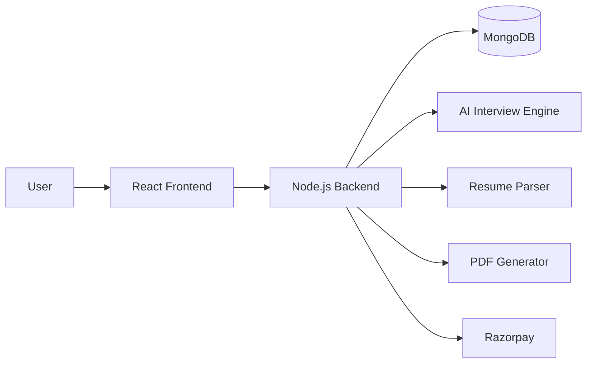
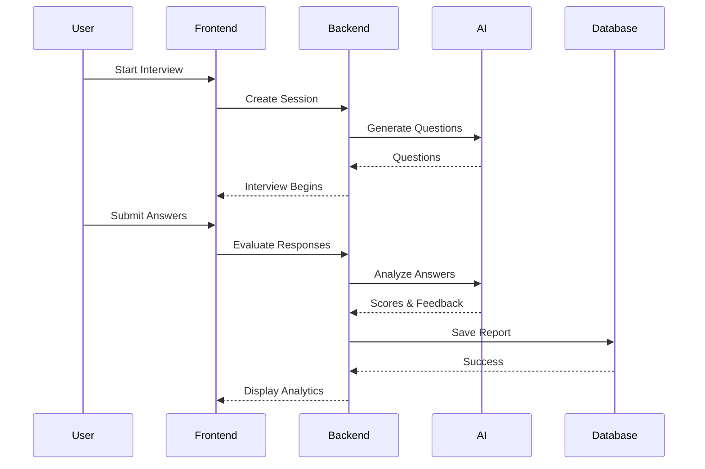
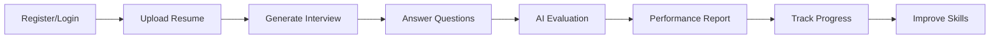
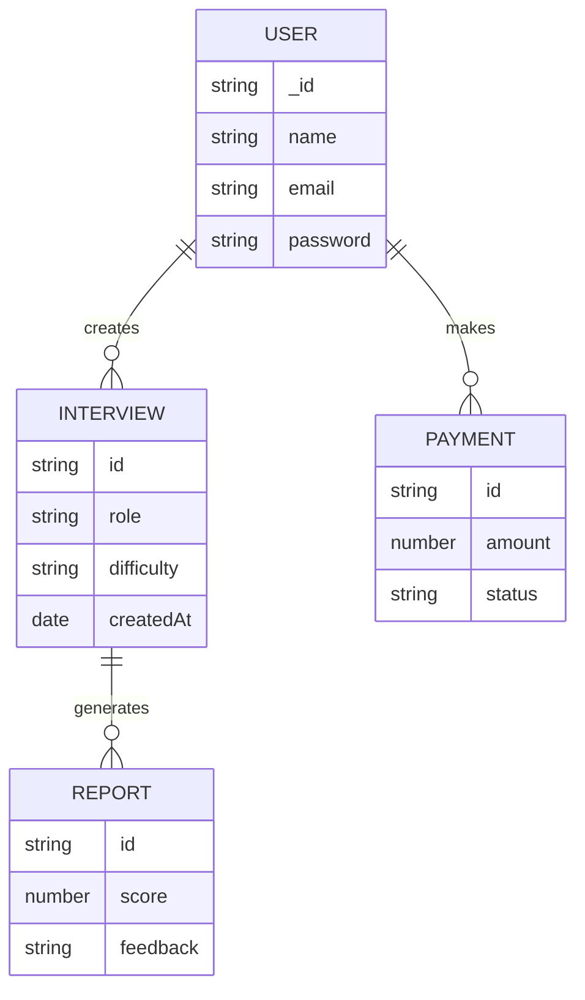

<div align="center">

# 🚀 InterviewAIM

### AI-Powered Mock Interview Platform for Students & Job Seekers

Practice interviews, get AI-generated feedback, track progress, and improve your interview performance with real-time analytics.

[]()
[]()
[]()
[]()
[]()
[]()

### 🌐 Live Demo

https://interviewai-client-f8pu.onrender.com

</div>

---

# 📖 Overview

InterviewIQ is a full-stack AI-powered interview preparation platform that helps students and job seekers prepare for technical and HR interviews.

The platform generates personalized interview questions, evaluates answers, provides detailed performance reports, and tracks interview history to help users improve continuously.

Designed using the MERN Stack with secure authentication, analytics dashboards, PDF report generation, and payment integration.

---

# ✨ Features

## 🤖 AI Mock Interviews

- Dynamic interview question generation
- Technical and HR interview rounds
- Personalized interview flow
- Realistic interview experience

## 📄 Resume-Based Question Generation

- Upload resume
- Extract skills automatically
- Generate role-specific questions

## 📊 Performance Analytics

- Communication Score
- Technical Score
- Confidence Score
- Overall Rating
- AI Feedback & Suggestions

## 📈 Progress Tracking

- Interview History
- Previous Reports
- Performance Trends
- Improvement Analysis

## 💳 Premium Features

- Razorpay Payment Integration
- Credit-Based Interview System
- Premium Interview Access

## 🔒 Secure Authentication

- JWT Authentication
- Protected Routes
- Secure API Endpoints
- Password Encryption

---

# 🏗️ System Architecture



---

# ⚙️ Tech Stack

## Frontend

- React.js
- Vite
- Tailwind CSS
- Redux Toolkit
- React Router

## Backend

- Node.js
- Express.js
- JWT Authentication
- REST APIs

## Database

- MongoDB
- Mongoose ODM

## Integrations

- Razorpay
- PDF.js
- jsPDF

## Deployment

- Netlify
- Render

---

# 📊 Project Flow



---

# 📈 User Journey



---

# 📁 Project Structure

```bash
InterviewIQ
│
├── client
│   ├── public
│   ├── src
│   │   ├── components
│   │   ├── pages
│   │   ├── redux
│   │   ├── hooks
│   │   ├── services
│   │   └── utils
│
├── server
│   ├── controllers
│   ├── routes
│   ├── middleware
│   ├── models
│   ├── services
│   ├── utils
│   └── config
│
└── README.md
```

---

# 🚀 Installation

## Clone Repository

```bash
git clone https://github.com/yourusername/InterviewIQ.git

cd InterviewIQ
```

## Frontend Setup

```bash
cd client

npm install

npm run dev
```

## Backend Setup

```bash
cd server

npm install

npm run dev
```

---

# 🔑 Environment Variables

## Server

```env
PORT=5000

MONGO_URI=

JWT_SECRET=

RAZORPAY_KEY_ID=

RAZORPAY_SECRET=
```

## Client

```env
VITE_API_URL=
```

---

# 📊 Database Design



---

# 🔒 Security Features

- JWT Authentication
- Protected Routes
- Password Hashing
- API Validation
- Secure Payment Verification
- Environment Variable Protection
- CORS Configuration

---

# 🎯 Key Learning Outcomes

This project demonstrates:

- Full Stack Development
- REST API Design
- Authentication & Authorization
- Database Modeling
- Payment Gateway Integration
- AI-Powered Applications
- State Management
- Deployment & DevOps

---

# 🚀 Future Improvements

- Voice-Based Interviews
- AI Avatar Interviewer
- Real-Time Coding Interviews
- ATS Resume Checker
- Company-Specific Interview Sets
- Multi-Language Support
- AI Career Roadmap Generator

---

# 👨‍💻 Author

## Mainak Debnath

B.Tech CSE Student  
Full Stack Developer | MERN Stack | AI/ML Enthusiast

### Connect With Me

- LinkedIn
- GitHub
- Portfolio

---

# ⭐ Support

If you found this project useful:

```bash
⭐ Star this repository
🍴 Fork this project
🚀 Contribute to InterviewIQ
```

---

<div align="center">

### "Practice Smarter. Interview Better. Get Hired."

⭐ Star the Repository if you liked the project.

</div>
