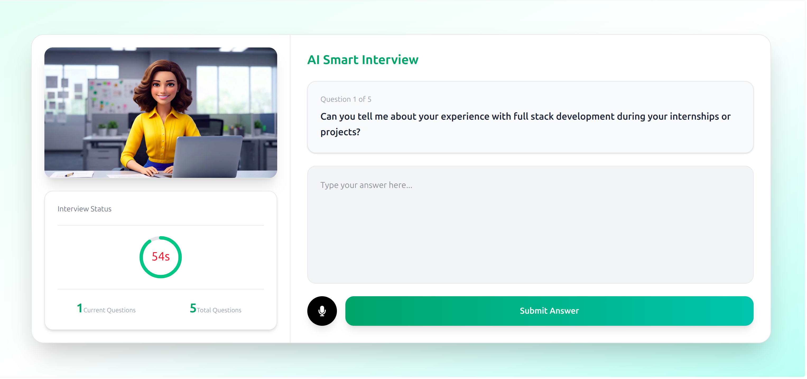
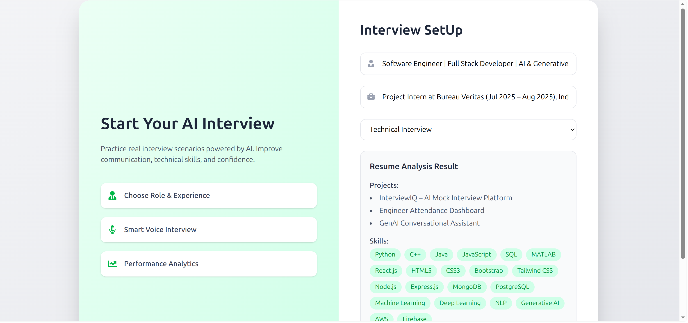
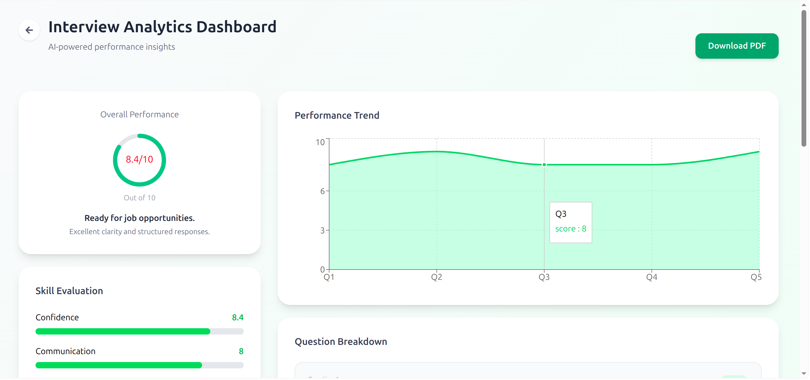

<div align="center">

# InterviewIQ

### AI-Powered Mock Interview Platform

Generate personalized interview questions, practice realistic interviews, and receive AI-generated feedback tailored to your resume.

<p>
  <a href="https://interviewai-client-f8pu.onrender.com/">Live Demo</a>
</p>

</div>

<br>

<p align="center">
  
</p>

---

## About

InterviewIQ is an AI-powered interview preparation platform that creates personalized interview experiences based on a candidate's resume.

The platform analyzes resumes, extracts skills and project information, generates role-specific interview questions, conducts AI-driven interview sessions, and provides detailed performance reports to help users prepare for real-world interviews.

---

## Key Highlights

* Resume-aware interview generation
* Technical and HR interview modes
* Voice-enabled interview experience
* AI-powered performance evaluation
* Detailed PDF reports
* Interview history tracking
* Secure authentication system
* Credit-based access model

---

## Product Preview

<table>
<tr>

<td align="center">
<br><br>
<b>Resume Analysis</b>
</td>

<td align="center">
<br><br>
<b>Performance Report</b>
</td>

</tr>
</table>

<br>

<p align="center">
  
</p>

<p align="center">
<b>AI Interview Session</b>
</p>

---

## How It Works

### 1. Upload Resume

Upload a PDF resume and let the platform analyze your profile.

### 2. Skill Extraction

InterviewIQ identifies:

* Skills
* Technologies
* Projects
* Experience Level

### 3. Interview Generation

AI generates personalized questions based on the candidate profile.

### 4. Interview Session

Practice through an interactive interview experience with voice and text support.

### 5. Performance Evaluation

Responses are evaluated for:

* Technical Accuracy
* Communication Quality
* Problem Solving
* Answer Completeness

### 6. Detailed Feedback

Receive a comprehensive performance report with actionable suggestions.

---

## Tech Stack

<div align="center">

### Frontend


### Backend


### Database


### AI


### Services


</div>

---

## Architecture

```text
                User
                  │
                  ▼
          React Frontend
                  │
                  ▼
          Express Backend
                  │
      ┌───────────┼───────────┐
      ▼           ▼           ▼
 Authentication  AI Engine  Reports
      │           │           │
      └──────┬────┴────┬──────┘
             ▼         ▼

         MongoDB   OpenRouter
```

---

## Project Structure

```text
InterviewAI
│
├── client
│   ├── src
│   ├── components
│   ├── pages
│   └── ...
│
├── server
│   ├── controllers
│   ├── routes
│   ├── models
│   ├── middleware
│   └── ...
│
├── Screenshots
│
└── README.md
```

---

## Local Setup

Clone the repository

```bash
git clone https://github.com/MainakDebnath6/InterviewAI.git
```

Install frontend dependencies

```bash
cd client
npm install
npm run dev
```

Install backend dependencies

```bash
cd server
npm install
npm start
```

Create a `.env` file

```env
MONGODB_URI=
JWT_SECRET=
OPENROUTER_API_KEY=
RAZORPAY_KEY_ID=
RAZORPAY_KEY_SECRET=
```

---

## Future Improvements

* Video Interview Support
* AI Interview Avatars
* Company-Specific Interview Tracks
* Real-Time Interview Coaching
* Multi-Language Support
* Advanced Analytics Dashboard

---

## Author

**Mainak Debnath**

Portfolio
https://whimsical-peony-203dfa.netlify.app/

LinkedIn
https://linkedin.com/in/mainak-debnath01

Email
[mainakdebnath13@gmail.com](mailto:mainakdebnath13@gmail.com)

---

If you found this project interesting, consider giving it a star.
